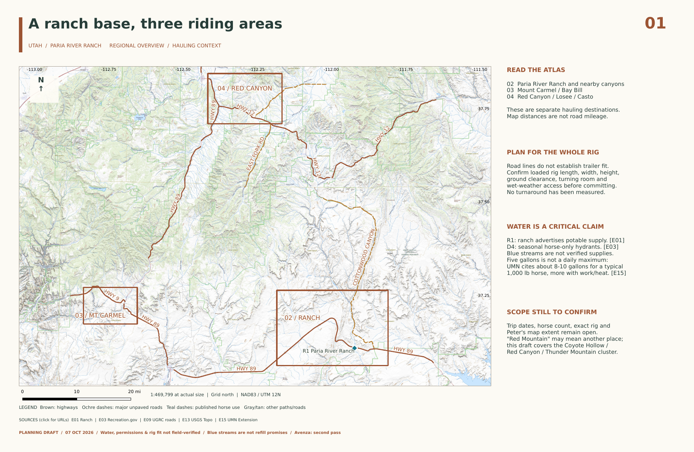

# Paria River Ranch — Utah horse-riding atlas

**First-pass planning draft, researched October 7, 2026.** Four printable sheets focused on Paria River Ranch and the requested regional riding leads. This is the horse-riding category of the map collection.

**[Download the four-page PDF](output/pdf/paria-river-ranch-four-sheets.pdf)** · **[Open the QGIS project](paria-river-ranch.qgz)** · [Sources](docs/SOURCES.md) · [Critical-evidence governance](docs/GOVERNANCE.md)



| Sheet | What it shows | Actual-size scale |
| --- | --- | --- |
| [01 — Regional overview](output/pdf/01-region.pdf) | Ranch base, three detail footprints, named highways and approach roads | approximately 1:469,799 |
| [02 — Ranch & canyon country](output/pdf/02-ranch.pdf) | Ranch water evidence, roads, published trail context and access concerns | approximately 1:110,738 |
| [03 — Mount Carmel / Bay Bill](output/pdf/03-mount-carmel.pdf) | Historical Barracks staging lead, canyon reference, separate Belly of the Dragon landmark | approximately 1:53,691 |
| [04 — Red Canyon](output/pdf/04-red-canyon.pdf) | Losee, Casto, Thunder Mountain, Coyote Hollow and Tom Best; local 1m terrain screening | approximately 1:73,826 |

The extents are provisional editorial choices, not a radius supplied by Peter. "Red Mountain" remains an ambiguous lead; the draft uses the Red Canyon/Thunder Mountain cluster associated with Coyote Hollow. Bay Bill Canyon and Belly of the Dragon are separate features. No map line created from prose is presented as a recorded ride.

## What the evidence establishes

- The ranch advertises potable water for people and horses. The marker is a facility reference, not a hydrant or entrance. Tank-fill permission, flow, current supply and rig placement are unverified.
- Coyote Hollow advertises **seasonal, horse-only, nonpotable hydrants** that may run out. This is not dependable on-trail water. The facility coordinate comes from Recreation.gov; hydrant positions are unknown.
- The 2022 Back Country Horsemen guide describes a Barracks staging option and warns against hauling farther downroad. It is historical evidence, not current owner permission. Its broad statements about BLM access are not adopted.
- Losee and Casto are trailhead references. Parking/turnaround capacity and dispersed camping permission have not been established. Tom Best is a road-junction lead, not a campsite.
- Five gallons is not treated as a horse's daily maximum. General University of Minnesota guidance is cited; trip-specific water planning still depends on horses, conditions and work.

Source IDs such as **E03** on the sheets resolve in [SOURCES.md](docs/SOURCES.md); the PDF source footer is clickable. Machine-readable evidence is in [evidence.json](sources/evidence.json), linked from [planning-points.geojson](sources/planning-points.geojson). Unknown measurements stay null. The [type vocabulary](docs/types.json) and validator enforce the project's local evidence profile; no international horse-water classification is claimed.

## Terrain and lidar

The Utah lidar coverage service identifies completed one-meter QL2 surveys at sampled locations, including Southern Utah 2018 and Kane County 2019. Those coverage polygons are discovery evidence, not proof that every map pixel comes from one survey.

For Thunder Mountain, a **3.2 × 3.2 km, 1m output crop** was extracted from USGS product `USGS_1M_12_x38y418_UT_StatewideKane_2020_A20`, published June 11, 2021. The project-name year is not asserted to be its acquisition date. The crop is reprojected with bilinear resampling into NAD83 / UTM zone 12N. About **67.2%** has usable slope data; the rest is explicitly shown gray inside the purple sample outline. No one-meter slope analysis is implied outside that outline.

Amber means 30–45 degrees and purple means 45+ degrees of **terrain-cell slope**. These are descriptive display bins, not horse-safety thresholds, road longitudinal grade or measured trail tread slope. Bare-earth grids cannot fully represent vertical faces, overhangs, exact cliff-edge positions or unstable footing. At 30 degrees, the mathematical grade is about 58 percent, not 30 percent.

[Two terrain perspectives](previews/thunder-terrain-two-views.png) provide a separate review companion. The surface is sampled every 8m and rendered with a 24m mesh, with no vertical exaggeration; blank regions have no source terrain. The USFS trail is draped on terrain and lifted 3m solely for visibility. Crop edges are not cliffs. These views are not extra atlas pages or precise avoidance instructions.

The other DEMs are USGS 3DEP service mosaics exported at approximately **63.65m / 15.00m / 10.00m / 13.75m** for sheets 1–4. Local hillshade and slope derivatives are included as optional QGIS layers. Those output pixel sizes are not native resolution or source accuracy. Catalog queries are complete candidate lists; exact source attribution per pixel is unresolved. USGS Topo provides the visible relief, hydrography and general geographic backdrop on all sheets.

## Open and print

Keep this entire directory together, then open `paria-river-ranch.qgz` in QGIS. **Project → Layouts** contains the four editable layouts. All displayed layers are local and work offline; citation links require internet. Sources retain WGS84 GeoJSON; the GeoPackage and terrain use **EPSG:26912**. GeoPackage string-list fields are serialized text; the GeoJSON remains the canonical evidence-ID array.

- Finished trim: **17 × 11 inches**, landscape.
- Artwork/bleed: **17.25 × 11.25 inches**, with 0.125 inch bleed on every edge.
- PDF MediaBox/BleedBox: `[0,0,1242,810]`; TrimBox: `[9,9,1233,801]` points.
- Print at 100% / actual size. The PDF contains searchable text and source links, with a raster topographic backdrop and vector overlays.
- RGB output; no printer-specific CMYK/PDF-X certification.
- **Avenza is the second pass.** Georeferencing export is disabled in this first-pass PDF; app compatibility and positional checks have not been performed.

## Files and reproducibility

`sources/` contains original public GIS feature attributes, complete object-ID inventories, request parameters, service metadata, terrain/basemap subsets and the evidence register. `derived/atlas.gpkg` contains portable presentation vectors. `derived/` also contains computed hillshade, slope and the classified native-terrain display. [manifest.json](sources/manifest.json) records SHA-256 hashes. [Validation](docs/validation.json) records automated checks; [visual review](docs/visual-review.md) records the rendered-page review.

The GIS environment used QGIS 3.22.16, GDAL 3.6, NumPy, Matplotlib, pypdf 3.4.1, DejaVu fonts and Poppler. The existing macOS QGIS 4 application was not used to certify GUI behavior.

```sh
# With python3-qgis, python3-gdal, python3-numpy, python3-matplotlib,
# python3-pypdf, poppler-utils and fonts-dejavu-core installed:
export QT_QPA_PLATFORM=offscreen
python3 scripts/build_evidence.py
python3 scripts/build_atlas.py
python3 scripts/terrain_views.py
python3 scripts/validate_atlas.py
```

Rebuilding uses local snapshots. `fetch_sources.py` and `fetch_rasters.py` refresh public data and require network access; completed snapshots are reused unless deliberately removed. Re-exporting manually from QGIS does not automatically apply the builder's PDF trim boxes or citation annotation. Keep manual edits separately before rebuilding, because builders regenerate derived outputs.

## Before a trip / second pass

Supply the desired center/extent, trip dates, horse count, truck/trailer dimensions and target apps. Confirm actual staging permission and dimensions, current water/refill arrangements, snow/mud, road condition and applicable closures with the relevant managers. The dated/expired sources and conflicting coordinates are documented rather than silently resolved. Then narrow the ride areas, collect route-specific observations and prepare/test georeferenced Avenza sheets.
