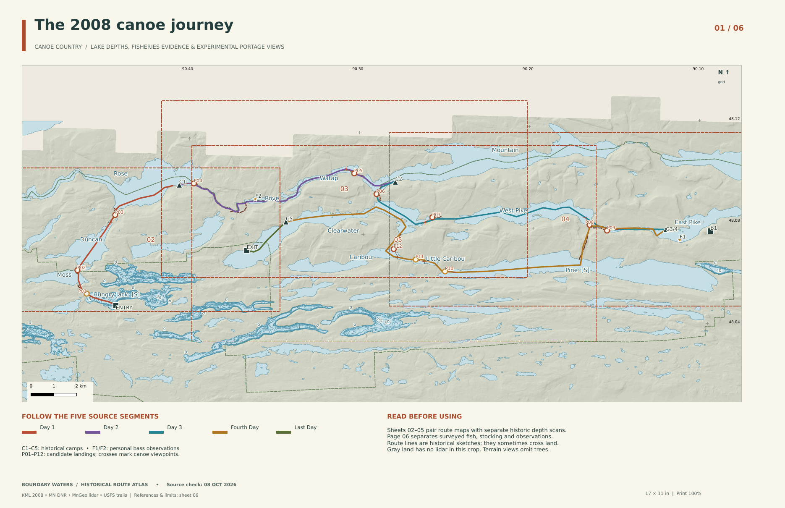

# Boundary Waters — 2008 canoe route atlas

A six-page, **17 × 11 inch landscape** atlas based on the supplied “2008 Boundary Waters Trip” KML. It pairs the historical route with Minnesota DNR lake-depth maps, dated fish-survey and stocking evidence, and twelve experimental canoe-eye terrain views. Source review: **October 8, 2026 UTC**.

**[Download the iPhone-friendly PDF](output/pdf/boundary-waters-iphone.pdf)** (8.6 MB; flattened page images, no attachments or clickable links). All six pages were verified with Apple PDFKit on macOS; a physical iPhone was not directly tested. This avoids the original PDF incompatibility reproduced with Apple’s renderer.

**[Download the full six-page PDF](output/pdf/boundary-waters-six-page-atlas.pdf)** · **[Open the editable QGIS project](boundary-waters.qgz)** · [Source register](docs/SOURCES.md) · [Validation](docs/validation.json)



| Page | Coverage | Supporting panels |
| --- | --- | --- |
| 01 | Whole historical trip and detail-sheet footprints | Route colors, camp/observation legend |
| 02 | Hungry Jack, Moss, Duncan and Rose approach | Hungry Jack/Moss/Duncan depth maps; P01–P03 |
| 03 | Rose, Rove, Watap and Mountain | Rose/Rove/Mountain depth maps; P04–P06 |
| 04 | Clearwater and the Pike lakes | Clearwater/West Pike/East Pike depth maps; P07–P09 |
| 05 | Pine, Little Caribou, Caribou and Clearwater return | Pine/Little Caribou/Caribou depth maps; P10–P12 |
| 06 | Thirteen lake fisheries records | Survey dates, species codes, recent stocking and evidence limits |

## Lake depths and fishing

The map body displays DNR digital depth contours where available; those are sparse on this route. Twelve independent historical scan panels supply additional lake-depth detail. **These panels are not georeferenced overlays, and their orientation and scale differ from the route maps.** Some long-lake numbers are too small at the panel’s printed size. The selected original PDFs are embedded as twelve attachments in the combined atlas, linked from the panels online, and saved in [sources/depth-scans](sources/depth-scans). Open the originals for full-resolution labels and metadata. Watap has no depth map in the checked DNR index; no bathymetry was invented for it.

Survey dates vary, including 1930s–1950s depth maps. Rose extends beyond the original sheet’s western edge; Caribou retains a source-scan artifact. Dates not established from the sheet remain unknown. [Depth source notes](docs/depth-sources.md) document these limitations. Depth metadata can disagree with old contour labels; the page-six maximum-depth column comes from LakeFinder metadata.

Fish species are positive catches in the latest returned **standard fish-catch survey**, not current guarantees or mapped survey stations. Newer temperature/oxygen surveys were not substituted for fish-population evidence. Recent stocking records identify **Hungry Jack walleye** and **Pine lake trout**. For the other eleven lakes, the current ten-year report has no data; that does not establish that they have never been stocked. The KML’s “Big Bass” and “Tons of Bass” are personal 2008 observations, labeled F1/F2. Contours can suggest fishing structure, but no unverified hot spots or within-lake survey locations are presented as measured evidence. [Fisheries methodology](docs/fisheries-evidence.md).

## Experimental portage views

Each square view is a **bare-earth terrain horizon from a mapped canoe viewpoint**, looking toward a candidate landing. The map marks the viewpoint, candidate, and sightline. Eleven views are approximately 400m offshore; Moss–Duncan uses 75m because a longer straight water view does not fit the mapped shoreline.

The Minnesota second-generation lidar service has native 0.5m pixels. This atlas uses an **8m bilinearly resampled crop**, not native-resolution landing measurements. Eye height is 0.8m above the DEM’s estimated water surface. Rays sample every 8m to 3km, over a 60-degree field of view with equal horizontal/vertical angular scale and **no vertical exaggeration**. Forest canopy is absent: these views are terrain experiments, not photographic treelines. P04 has incomplete terrain along 13.7% of rays; the true horizon can extend beyond the crop’s coverage and 3km range. [View parameters](derived/portage-views.json).

All landings are map-derived and **not field verified**. P01 (Hungry Jack–Moss) has an approximately 383m mismatch between the published trail endpoint and mapped shore. P10/P11 (Pine–Little Caribou–Caribou) lack corresponding trails in the complete USFS query. Those three are prominently marked **unresolved landing** and are not reliable aiming instructions. The others have USFS trail/shoreline support. The return route turns at the West Pike trail junction without a separate water approach. [Portage evidence](docs/portage-evidence.md).

## Open, print and rebuild

Keep this directory intact and open `boundary-waters.qgz`. All layer and picture paths are relative and local; **Project → Layouts** contains six editable sheets. The printed atlas uses NAD83 / UTM zone 15N, grid north, depth feet, and distance kilometers. Print at 100%. This export has no bleed and is not an Avenza-validated GeoPDF.

The historical KML’s five route lines and 160 vertices are preserved exactly. Some lines cross land and should be understood as historical sketch geometry. Modern GIS layers do not certify the historical camps or landing positions. Gray land is missing lidar coverage, including much of Canada; water polygons extend beyond that terrain footprint.

Build dependencies: QGIS 3.22, GDAL, NumPy, SciPy, Matplotlib, Pillow, pypdf, Poppler and DejaVu Sans. Shapely is needed only to regenerate portage candidates. The delivered build used QGIS 3.22.16 in a Linux container; QGIS 4 GUI behavior was not separately certified.

```sh
export QT_QPA_PLATFORM=offscreen
python3 scripts/prepare.py
python3 scripts/terrain_views.py
python3 scripts/build_atlas.py
python3 scripts/validate_atlas.py
```

These commands use saved source snapshots. To refresh source data, use `scripts/fetch_vectors.py`, `scripts/fetch_terrain.py` and `scripts/depth-download.py` deliberately; their output may differ as source services change. Regenerate scan panels with `scripts/depth-render.py` and `scripts/depth-panels.py`. `sources/portage-derive.py` documents the source-index choices used for this snapshot; re-review those choices before using a refreshed USFS response. Fisheries source URLs and raw snapshots are retained in `sources/fisheries.json` and `sources/fisheries-raw/`.

Sources retain their own terms and attribution, including Minnesota DNR copyright on the lake maps. [Checksums](docs/manifest-sha256.json) identify the data snapshots and exported PDFs. [Visual review](docs/visual-review.md) records the final page inspection.
