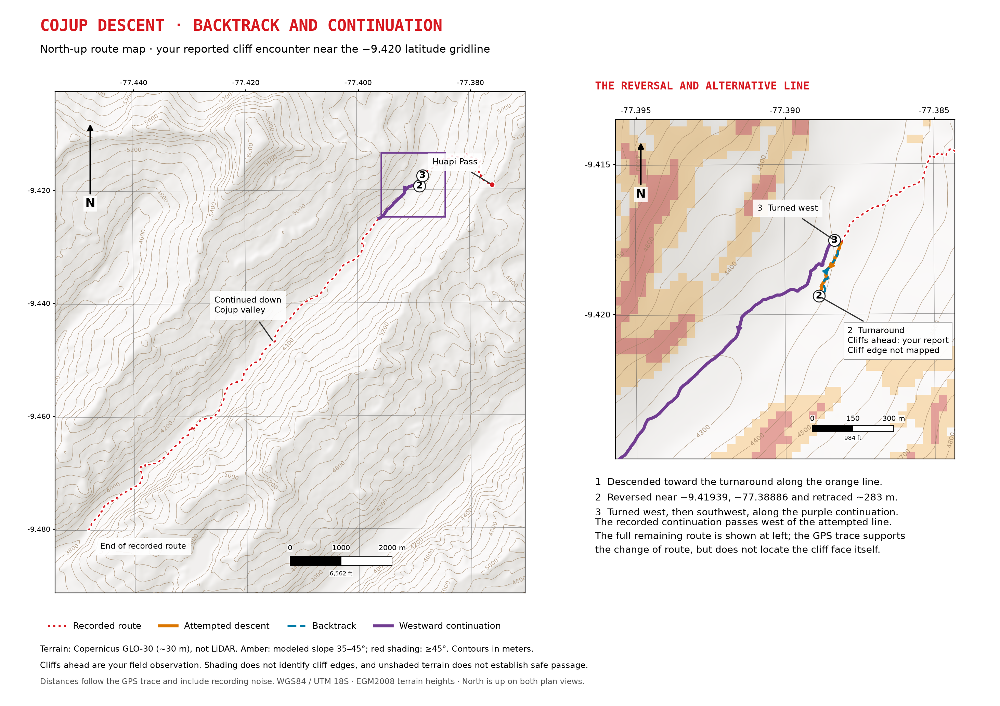

# Huapi Pass and Cojup descent

Terrain review of the recorded Quilcayhuanca–Huapi Pass–Cojup loop near Huaraz, Peru. Maps follow the pale relief, brown contours, red GPS trace, and latitude/longitude grid used in the repository’s [Upper Quilcene map](../../upperquilcene/GPS%20Coordinates%20250%20dpi.pdf).

## Maps

- [Huapi Pass: north-up map and 3D views](huapi-north-up-and-3d.pdf): three A4 landscape pages covering the final approach (area A) and initial north-side descent (area B), with four perspectives of each.
- [Cojup: backtrack and remaining valley route](cojup-backtrack-and-valley.pdf): three A4 landscape pages with a north-up overview and enlargement, four local 3D perspectives, and two views of the remaining descent.
- [250 dpi map images](images): individual pages and standalone detail maps.

Near latitude −9.420, the GPS trace reverses at approximately **−9.419393, −77.388862**, retraces about **283 m**, then turns west and continues southwest down the valley. Orange marks the attempted descent, blue the backtrack, and purple the westward continuation. Distances follow the GPS trace and include recording noise. Cliffs ahead were reported by the hiker; their exact boundaries have not been mapped.

## Data and limitations

- Original track: [Quilcayhuanca-Cojup_2021.gpx](../../../gps%20datapoints/Peru/Quilcayhuanca-Cojup_2021.gpx). The existing file remains the source of record. Its filename and embedded timestamps differ; no hike date is inferred here.
- Elevation: **Copernicus GLO-30 satellite digital surface model, approximately 30 m**, AWS 2021 release; this is **not LiDAR**. [Dataset information](https://registry.opendata.aws/copernicus-dem/).
- Source tile: [Copernicus_DSM_COG_10_S10_00_W078_00_DEM.tif](https://copernicus-dem-30m.s3.amazonaws.com/Copernicus_DSM_COG_10_S10_00_W078_00_DEM/Copernicus_DSM_COG_10_S10_00_W078_00_DEM.tif).
- Terrain is bilinearly reprojected to WGS84 / UTM zone 18S (EPSG:32718), at 30 m spacing. Elevations use EGM2008, in meters. GeoJSON coordinates use WGS84 longitude/latitude (EPSG:4326).
- Contours are derived from this terrain model, typically 100 m in overviews and 50 m in enlargements. GPS altitude is not used for terrain heights.
- Slope uses central finite differences on the 30 m grid. Amber denotes modeled slope 35–45° and red shading ≥45°. These are illustrative bins, not validated hazard classes or trail grades.
- The approximately 6 ft / 1.8 m step reported near the pass and exact cliff edges cannot be resolved reliably with this dataset. Unshaded terrain does not establish safe passage.
- The 3D views use equal horizontal and vertical scales, with no vertical exaggeration. Route lines are drawn over the surface, offset approximately 4–5 m for visibility. Full-valley 3D views sample every second grid cell (60 m display spacing).
- Review sections A and B are approximate areas inferred from the hiker’s description, not surveyed hazard boundaries. GPS horizontal accuracy is unverified.

## QGIS-ready layers

The [sources](sources) directory contains:

| File | Contents |
| --- | --- |
| `topographic-area-dem30m.tif` | Numeric terrain elevation, meters |
| `pale-topographic-relief.tif` | Colored relief background |
| `modeled-slope-30m.tif` | Numeric modeled slope, degrees |
| `modeled-steep-terrain-overlay.tif` | Transparent illustrative slope shading |
| `route-and-waypoints.geojson` | Recorded route and named waypoints |
| `review-areas.geojson` | Areas A/B and approximate review sections |
| `cojup-backtrack-phases.geojson` | Attempt, backtrack, continuation, and turning points |
| `*-metadata.json`, `cojup-backtrack-summary.json` | View metadata and route interpretation |

Add these layers to QGIS with the relief below the overlay and route. The existing [Peru QGIS project](../peru.qgz) is unchanged. These PDFs were exported with Python cartographic plotting tools; this folder does not contain an editable QGIS print-layout project.
