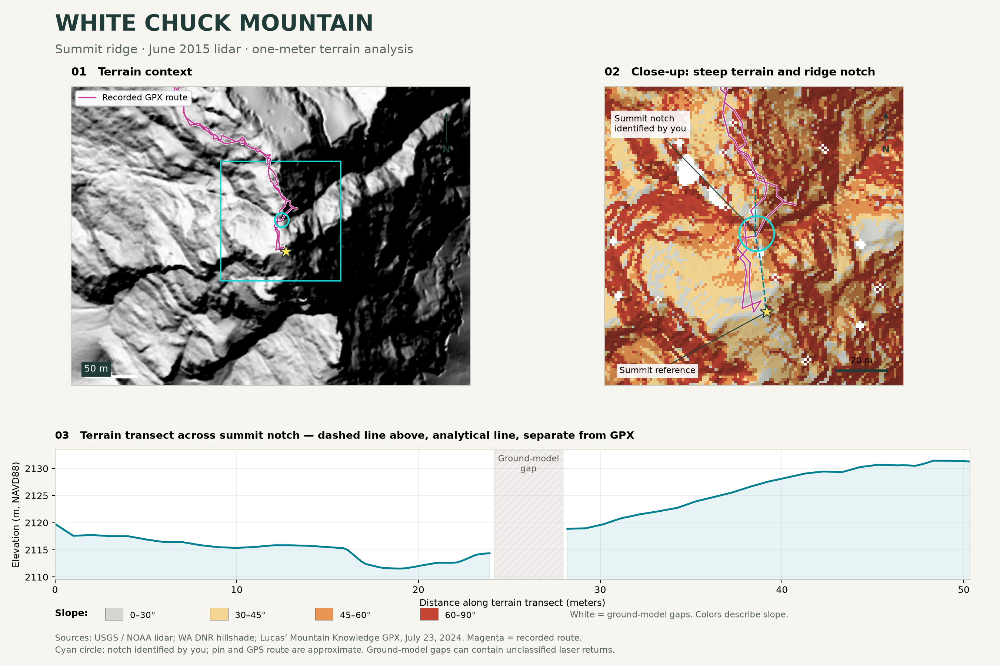

# White Chuck Mountain

Lidar maps of the summit notch and exposed approach north/northwest of it, North Cascades, Washington. The notch was identified from firsthand hiking recollection and compared with a recorded 2024 route.

## Maps

| View | File |
| --- | --- |
| Summit terrain, slope, GPX and profile | [PNG](images/white-chuck-summit-map.png) · [PDF](white-chuck-summit-map.pdf) |
| Highlighted notch and explained gaps | [Profile explainer](images/notch-profile-explainer.png) |
| Original filtering diagnosis | [Point comparison](images/gap-explanation.png) |
| Experimental rock-notch model | [Map and profile](images/notch-rock-model.png) |
| Exposed ridge from four viewpoints | [Perspectives](images/ridge-four-perspectives.png) |
| Rotating ridge preview | [Animation](images/ridge-rotation.gif) |

## Offline 3D viewers

Download [notch-3d.html](interactive/notch-3d.html) or [ridge-3d.html](interactive/ridge-3d.html) with GitHub's **Download raw file** button, then open the downloaded file in a desktop browser. Each bundles its JavaScript and data: no temporary server or internet connection is needed. Drag to rotate and scroll to zoom. Interactive 3D requires WebGL; images and GIF do not. GitHub's normal HTML file view shows source instead of the viewer.

## QGIS layers

Drag files from `sources/` into QGIS:

- `styled_slope.tif`: ready-colored summit slope map.
- `terrain_1m.tif`, `hillshade.tif`, `slope_degrees.tif`: original ground-only analysis.
- `ground_points_per_m2.tif`: ground-return count before filling.
- `annotations.geojson`: approximate markers and analytical transect.
- `notch-model/experimental_rock_surface_50cm.tif`: local experimental rock surface.
- `ridge-exposure/experimental_ridge_surface_1m.tif`: wider experimental surface.

Raw lidar and GPX source files are not redistributed here; use the original source links below.

No new `.qgz` project is included; these are georeferenced layers and exported maps. The analytical profile is distinct from the GPX track.

## Sources

- [Washington DNR portal](https://lidarportal.dnr.wa.gov/): official hillshade; Glacier Peak 2015 coverage.
- [USGS/NOAA survey metadata](https://www.fisheries.noaa.gov/inport/item/58960) and [download index](https://noaa-nos-coastal-lidar-pds.s3.amazonaws.com/laz/geoid18/9042/index.html): airborne lidar, summit tile dated June 8, 2015. Direct tile URL and CRS: [source.json](sources/source.json).
- [Lucas' Mountain Knowledge](https://www.lucasmountainknowledge.com/post/white-chuck-mountain-july-2024): July 23, 2024 GPX, 1,058 points, recorded in Gaia GPS. The track remains attributed to its source.
- [Washington Trails Association](https://www.wta.org/go-hiking/hikes/white-chuck-mountain): reported 15–20 ft downclimb.
- [Peakbagger](https://www.peakbagger.com/peak.aspx?pid=1787): approximate summit reference coordinate.

Lidar depicts geometry, not loose-rock stability. The scree description is a firsthand observation; highlighted boundaries are approximate. GPS does not establish exact trail width or cliff-edge position. The mesh boundary is a crop edge, not a physical cliff. The 2015 survey does not establish present conditions.

See [METHODS.md](METHODS.md) for assumptions and sensitivity. [manifest.json](sources/manifest.json) records artifact sizes and SHA-256 checksums.
